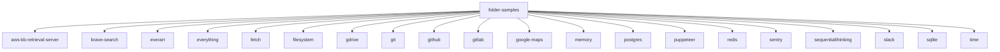

# Codex MCPs Demo Folder Structure

```mermaid
graph TD
    root[folder-samples]

    %% Server implementations
    aws[aws-kb-retrieval-server]
    brave[brave-search]
    everart[everart]
    everything[everything]
    fetch[fetch]
    filesystem[filesystem]
    gdrive[gdrive]
    git[git]
    github[github]
    gitlab[gitlab]
    gmaps[google-maps]
    memory[memory]
    postgres[postgres]
    puppeteer[puppeteer]
    redis[redis]
    sentry[sentry]
    sequential[sequentialthinking]
    slack[slack]
    sqlite[sqlite]
    time[time]

    %% Connect all to root
    root --> aws
    root --> brave
    root --> everart
    root --> everything
    root --> fetch
    root --> filesystem
    root --> gdrive
    root --> git
    root --> github
    root --> gitlab
    root --> gmaps
    root --> memory
    root --> postgres
    root --> puppeteer
    root --> redis
    root --> sentry
    root --> sequential
    root --> slack
    root --> sqlite
    root --> time
```